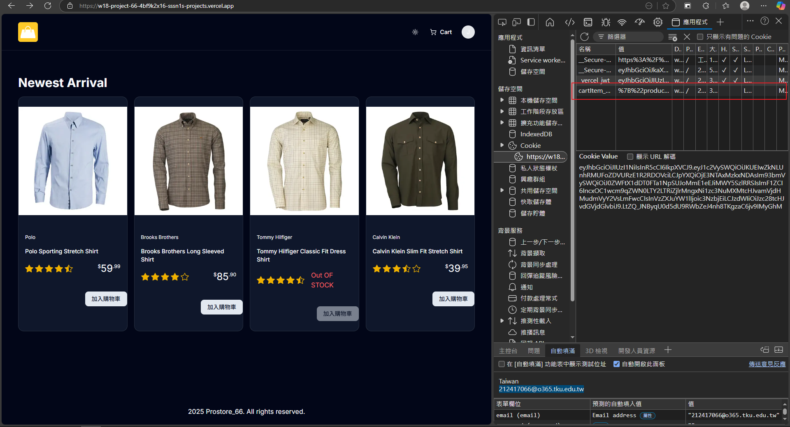
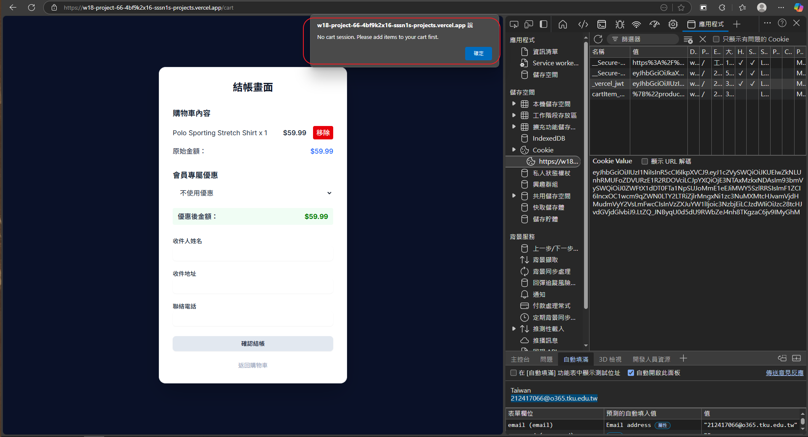

[Github URL](https://github.com/sssn1/w18-project-66.git)
[vercel URL](w18-project-66-4bf9k2x16-sssn1s-projects.vercel.app)

我做了加入購物車跟結帳的功能
我做這個遇到了很多的問題 嘗試新增商品到購物車並生成 Cookie：
我使用了 addItemToCart 函數來新增商品到購物車，但遇到問題，導致 Cookie 無法正確生成
嘗試移除商品並更新購物車：
我使用了 handleRemoveItem 函數來移除商品，但遇到問題，導致商品無法正確移除，並出現錯誤訊息
我本來是要按一下加入購物車加進資料庫但一直有問題修不好只好改成按一下產生一個cookie 但我結帳頁面的移除按鈕也一直壞掉我還沒找到問題

